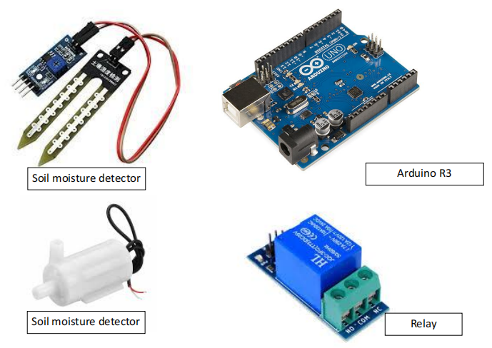
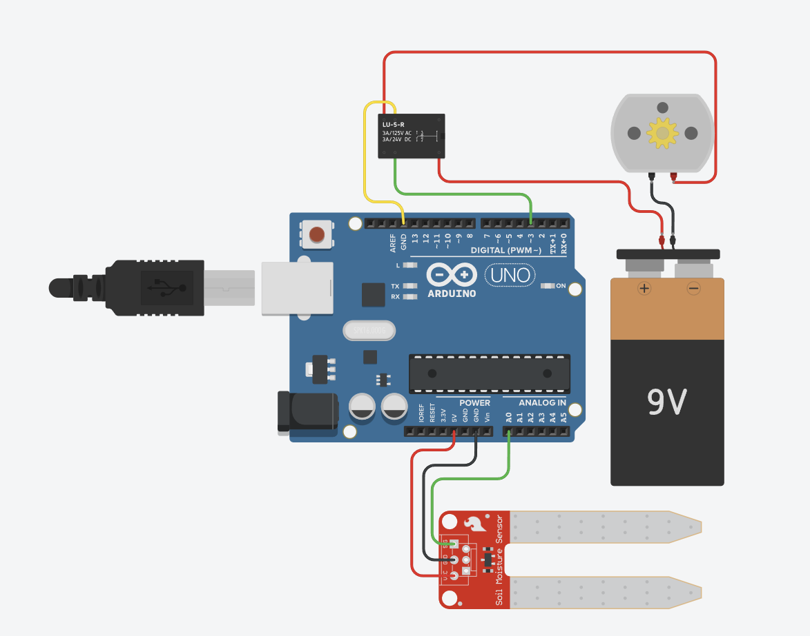
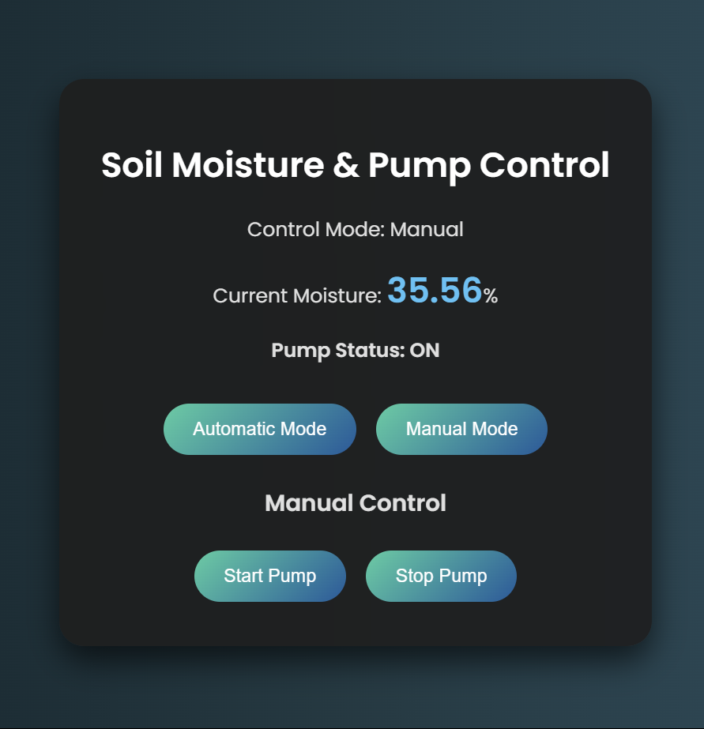
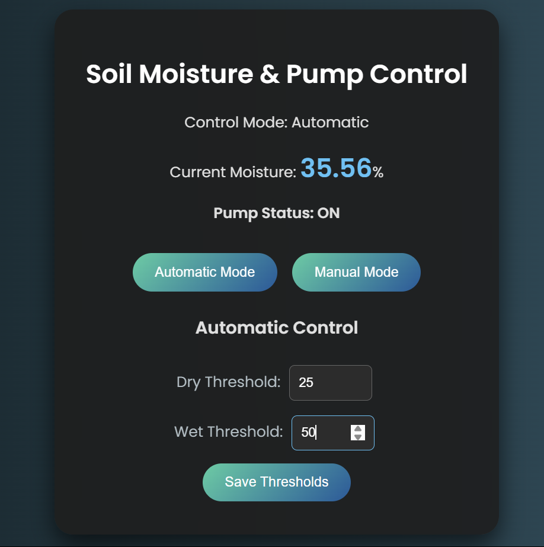
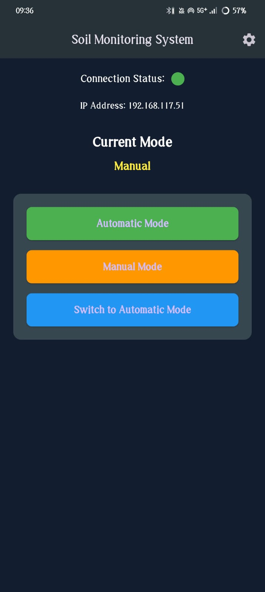
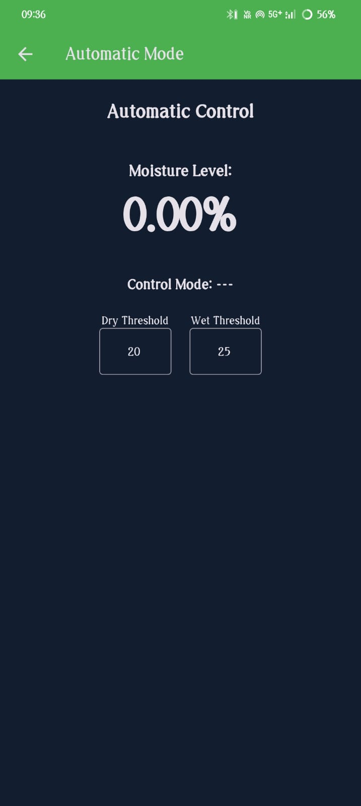

# Soil Moisture & Pump Control System

## Overview

This project is an **automated plant watering system** using **Arduino**, a **soil moisture sensor**, a **relay module**, and a **water pump**. The system monitors the soil moisture level and automatically turns the pump **ON** or **OFF** based on the soil's moisture condition.

Additionally, a **Flutter-based mobile application** was developed to provide remote control and real-time monitoring of the system.

## Components Used

- **Arduino** (Uno/Nano)
- **Soil Moisture Sensor** (Analog Output)
- **Relay Module** (Single Channel 5V)
- **Water Pump** (9V DC)
- **9V Battery** (Power Source)
- **Jumper Wires**

    

<b>Figure 1: Components Used</b>

## Circuit Connections

| Component                                | Arduino Pin        | Notes                                |
| ---------------------------------------- | ------------------ | ------------------------------------ |
| **Soil Moisture Sensor (Analog Output)** | A0                 | Reads soil moisture level (0-1023)   |
| **Relay Module IN Pin**                  | Digital 7          | Controls pump (LOW = ON, HIGH = OFF) |
| **Relay Module VCC**                     | 5V                 | Power for relay module               |
| **Relay Module GND**                     | GND                | Common ground                        |
| **Pump (Connect to Relay NO & COM)**     | -                  | Powered through relay                |
| **Pump Power (9V Battery +)**            | Relay Common (COM) | Provides power to the pump           |
| **Pump GND (9V Battery -)**              | GND                | Common ground                        |

## Circuit Diagram

    

<b>Figure 2: Circuit Diagram</b>

## Web Interface Screenshots

  &nbsp;
  

<b>Figure 3 & 4: Web Interface Screens</b>

## Mobile App Screenshots

  &nbsp;
  &nbsp;
  

<b>Figure 5, 6 & 7: Mobile App Screens (Developed in Flutter)</b>

## How It Works

1. The **soil moisture sensor** continuously measures the soil moisture level.
2. If the moisture level **drops below the dry threshold**, the **relay activates the pump**, watering the plant.
3. Once the soil reaches the **wet threshold**, the **pump turns off** automatically.
4. The system operates in either **automatic** or **manual** mode.
   - **Automatic Mode:** System controls the pump based on soil moisture.
   - **Manual Mode:** User can manually turn the pump ON/OFF.

## Installation & Usage

### 1️⃣ Upload Code to Arduino

1. Install **Arduino IDE** and necessary libraries.
2. Connect **Arduino** to your PC via USB.
3. Upload the Arduino sketch (provided in `code.ino`).

### 2️⃣ Connect the Circuit

Follow the **connection table** above to wire all components correctly.

### 3️⃣ Power the System

- Use a **9V battery** or **5V adapter** to power the Arduino.
- Ensure correct relay wiring to prevent pump damage.

## Features

✅ **Automated Soil Moisture Detection**  
✅ **Auto Pump Control via Relay**  
✅ **Manual Mode for Custom Control**  
✅ **Low Power Consumption**

## Tech Stack

- **Arduino C++** – Logic for sensor reading and relay control
- **Flutter** – Cross-platform mobile app development
- **HTML/CSS/JavaScript** – Web interface for control and monitoring

## Application Link

📱 [Download the App](/soil_monitor_app/Soil%20Monitoring.apk)

ℹ️ First of all, set the IP of your hotspot (shown in the app’s top-right corner). Once successfully connected, the control buttons will be activated.

🔧 The app can be modified using the Flutter source code provided in the repository.
[Rebuild](soil_monitor_app/README.md)

## Video Demo

🎥 [Watch](Comming_Soon)

## License

This project is open-source. Feel free to use and modify it! 🚀

